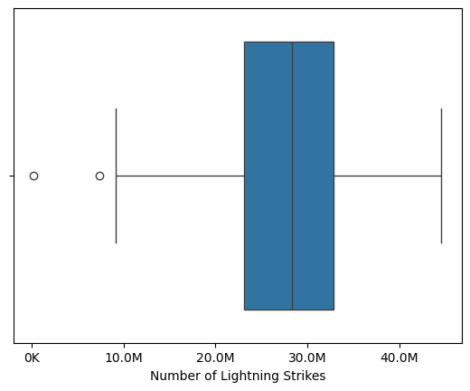
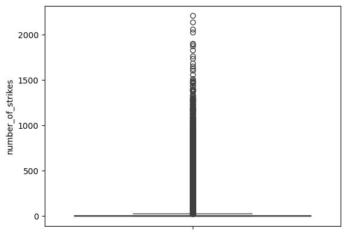
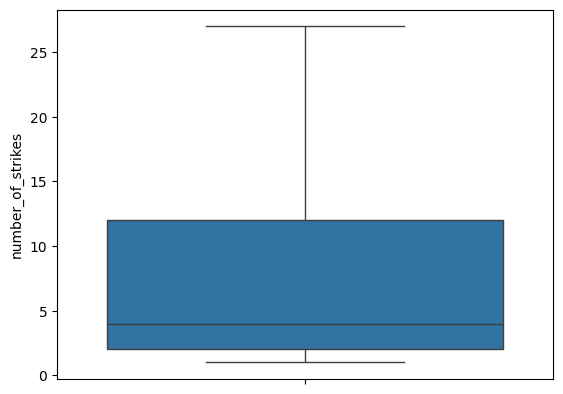

### Missing Data is not fine.... or ..... fine, its missing data

This notebook covers an interesting case study into how interesting things can get even when we are just cleaning data. here is a gist: The dataset in the notebook is lightning strikes data in the US. As you will see below, there is associated zipcode data as well. And a number of values in the zip code column are missing which suggest there could be something wrong with the dataset. However, a closer inspection reveals a different scenario. 

The first block is just importing the packages. 


```python
# Import statements
import pandas as pd
import numpy as np
import seaborn as sns
import datetime
from matplotlib import pyplot as plt
```

### Topic: Missing or Duplicate Data

The csvs imported for this are


```python
df_missing1 = pd.read_csv("/Users/shanr/Desktop/Google Data Analytics Certificate/Data Files for Follow Along Exercises/Files/home/jovyan/work/eda_missing_data_dataset1.csv")
df_missing2 = pd.read_csv("/Users/shanr/Desktop/Google Data Analytics Certificate/Data Files for Follow Along Exercises/Files/home/jovyan/work/eda_missing_data_dataset2.csv")
print(df_missing1.head(5))
print("Second Dataset below")
print(df_missing2.head(5))
```

             date  center_point_geom  longitude  latitude  number_of_strikes
    0  2018-08-01  POINT(-81.6 22.6)      -81.6      22.6                 48
    1  2018-08-01  POINT(-81.1 22.6)      -81.1      22.6                 32
    2  2018-08-01  POINT(-80.9 22.6)      -80.9      22.6                118
    3  2018-08-01  POINT(-80.8 22.6)      -80.8      22.6                 69
    4  2018-08-01  POINT(-98.4 22.8)      -98.4      22.8                 44
    Second Dataset below
             date  zip_code                                 city          state  \
    0  2018-08-08      3281                                Weare  New Hampshire   
    1  2018-08-14      6488                 Heritage Village CDP    Connecticut   
    2  2018-08-16     97759  Sisters city, Black Butte Ranch CDP         Oregon   
    3  2018-08-18      6776                      New Milford CDP    Connecticut   
    4  2018-08-08      1077                            Southwick  Massachusetts   
    
      state_code   center_point_geom  number_of_strikes  
    0         NH   POINT(-71.7 43.1)                  1  
    1         CT   POINT(-73.2 41.5)                  3  
    2         OR  POINT(-121.4 44.3)                  3  
    3         CT   POINT(-73.4 41.6)                 48  
    4         MA     POINT(-72.8 42)                  2  


Lets explore the shapes of the datasets. Then we are going to look for nulls and missing values. 
Concepts explored here from a code point of view are as follows:-
Note: The concepts are mainly from the Google Certified Data Analyst(GCDA) course and some python learnings of my own. 
1. Shape of the Dataset using the `shape` attribute of dataframe
2. Information about datatypes using the `info` function
3. Describing summary stats using the `describe()` function
4. Identifying how many rows have a missing value in the columns using `isna()` function


```python
print("Rows and columns :", df_missing1.shape)
print("Information about the datatypes in the df:", df_missing1.info())
print("General stats about dataframe: ", df_missing1.describe())
print("Total rows with missing values in any of the columns: ", df_missing1.isna().sum())
```

    Rows and columns : (717530, 5)
    <class 'pandas.core.frame.DataFrame'>
    RangeIndex: 717530 entries, 0 to 717529
    Data columns (total 5 columns):
     #   Column             Non-Null Count   Dtype  
    ---  ------             --------------   -----  
     0   date               717530 non-null  object 
     1   center_point_geom  717530 non-null  object 
     2   longitude          717530 non-null  float64
     3   latitude           717530 non-null  float64
     4   number_of_strikes  717530 non-null  int64  
    dtypes: float64(2), int64(1), object(2)
    memory usage: 27.4+ MB
    Information about the datatypes in the df: None
    General stats about dataframe:             longitude       latitude  number_of_strikes
    count  717530.000000  717530.000000      717530.000000
    mean      -90.875445      33.328572          21.637081
    std        13.648429       7.938831          48.029525
    min      -133.900000      16.600000           1.000000
    25%      -102.800000      26.900000           3.000000
    50%       -90.300000      33.200000           6.000000
    75%       -80.900000      39.400000          21.000000
    max       -43.800000      51.700000        2211.000000
    Total rows with missing values in any of the columns:  date                 0
    center_point_geom    0
    longitude            0
    latitude             0
    number_of_strikes    0
    dtype: int64


```python
#repeat same exercise as above for the second dataset
print("Rows and columns :", df_missing2.shape)
print("Information about the datatypes in the df:", df_missing2.info())
print("General stats about dataframe: ", df_missing2.describe())
print("Total rows with missing values in any of the columns: ", df_missing2.isna().sum())

```

    Rows and columns : (323700, 7)
    <class 'pandas.core.frame.DataFrame'>
    RangeIndex: 323700 entries, 0 to 323699
    Data columns (total 7 columns):
     #   Column             Non-Null Count   Dtype 
    ---  ------             --------------   ----- 
     0   date               323700 non-null  object
     1   zip_code           323700 non-null  int64 
     2   city               323700 non-null  object
     3   state              323700 non-null  object
     4   state_code         323700 non-null  object
     5   center_point_geom  323700 non-null  object
     6   number_of_strikes  323700 non-null  int64 
    dtypes: int64(2), object(5)
    memory usage: 17.3+ MB
    Information about the datatypes in the df: None
    General stats about dataframe:              zip_code  number_of_strikes
    count  323700.000000      323700.000000
    mean    57931.958996          25.410587
    std     22277.327411          57.421824
    min      1002.000000           1.000000
    25%     38260.750000           3.000000
    50%     59212.500000           8.000000
    75%     78642.000000          24.000000
    max     99402.000000        2211.000000
    Total rows with missing values in any of the columns:  date                 0
    zip_code             0
    city                 0
    state                0
    state_code           0
    center_point_geom    0
    number_of_strikes    0
    dtype: int64


Since this exercise is also about merging the datasets, the two datasets in question here are to be merged as well. However we can notice that the second dataset is almost half the size of the first one. The first one had `700K` rows roughly whereas the second one has `320K` rows roughly. 

**Some context on the datasets used here**
These are lightning strike datasets. As it can be obsererved here, both the datasets have location information in form of latitudes and longitudes and both the datasets have the number of lightning strike totals available. The second dataset has place and zip code information which is essential. The second dataset seems to be missing a number of rows. 

**But is the other information in the two datassets similar?** 
Here we explore the conctpt of **joins** and we merge the two datasets and fin out if the the data is similar or not. 

Concepts explored here are:-
(Note: Most of these concepts come from GCDA program and some of them are my own learnings)

1. Using the `merge()` function to join two datasets
2. Exploring different kind of joins in pandas


```python
#merging the two datasets to identify the same data points and see of the data is matching
#merge will be on lat, longitude and date

df_missing_merged = df_missing1[['date','center_point_geom','number_of_strikes']].merge(df_missing2[['date', 'center_point_geom', 'number_of_strikes']], on=['date', 'center_point_geom'], suffixes=('_1','_2'))
print(df_missing_merged.head(5))
print("Shape of merged df:",df_missing_merged.shape)
```

             date  center_point_geom  number_of_strikes_1  number_of_strikes_2
    0  2018-08-01    POINT(-99 26.6)                   26                   26
    1  2018-08-01  POINT(-81.7 30.8)                   44                   44
    2  2018-08-01  POINT(-81.6 30.8)                   25                   25
    3  2018-08-01  POINT(-81.2 26.5)                   51                   51
    4  2018-08-01  POINT(-81.7 30.9)                   76                   76
    Shape of merged df: (323700, 4)


As you can see the merged dataframe has 4 columns. the first two columns on which the merge was done are not repeated. The values column has two suffixes which differentiate which dataframe they come from. Initial investigation suggests that the number of strikes are the same for both the datasets but we need to confirm this. We can do this in multiple ways. 
1. Subtract `number_of_strikes_1` from `number_of_strikes_2` and save the result in a different column. If the value is 0 for a sum of the other column then the values match.
2. Have another column which compars `number_of_strikes_1` and `number_of_strikes_2` putting in a true or false value. Then count the number of trues. It should be the same as the total number of rows in the merged dataset to confirm that the values are the same.

We will try the first approach.


```python
#new column subtracting number_of_striks_1 from number_of_strikes_2
df_missing_merged['diff'] = df_missing_merged['number_of_strikes_1'] - df_missing_merged['number_of_strikes_2']
print("If this number is not zero, we have a mismatch or data corruption problem in the data: ", df_missing_merged['diff'].sum())
```

    If this number is not zero, we have a mismatch or data corruption problem in the data:  0


Since the sum is zero, the values are the same. Now **why is the number of values in the sendond dataset is half of the first dataset?** 
One possible reason is that we do not have zip code data for the missing values. Suggesting it could be a missing data issue or **maybe those datapoints do not lie on a place which has a zip code** . How can we explore this further ? 

1. Step 1: We are going to get all the data points which are missing in the second dataset, from the first dataset.
2. Step 2: We are going to plot these datapoints on a map to see where they lie. We can do this because we have the latitude and longitude information.

Concepts explored here are:-

1. `Anti-Joins` in python, where only the columns in left table are returned which are not present in the right table
2. `Left Join` and then filtring to obtain the same result as anti-joins


```python
#Get the missing data points using anti join
#indicator param will add a column called _merge to the new dataset which shows us if the data point exists in both the datasets or only the left one
df_missing_merged_2 = df_missing1.merge(df_missing2, on =['date', 'center_point_geom'], suffixes=('_1','_2'), how='left', indicator=True)
print(df_missing_merged_2.head())
#Now we can filter the dataset to have only the _merge column which is 'left_only'
df_missing_merged_2 = df_missing_merged_2[df_missing_merged_2['_merge']=='left_only']
#If we print the shape we will notice the new one just includes only those rows which have the zip code and other location data missing
print(df_missing_merged_2.shape)
```

             date  center_point_geom  longitude  latitude  number_of_strikes_1  \
    0  2018-08-01  POINT(-81.6 22.6)      -81.6      22.6                   48   
    1  2018-08-01  POINT(-81.1 22.6)      -81.1      22.6                   32   
    2  2018-08-01  POINT(-80.9 22.6)      -80.9      22.6                  118   
    3  2018-08-01  POINT(-80.8 22.6)      -80.8      22.6                   69   
    4  2018-08-01  POINT(-98.4 22.8)      -98.4      22.8                   44   
    
       zip_code city state state_code  number_of_strikes_2     _merge  
    0       NaN  NaN   NaN        NaN                  NaN  left_only  
    1       NaN  NaN   NaN        NaN                  NaN  left_only  
    2       NaN  NaN   NaN        NaN                  NaN  left_only  
    3       NaN  NaN   NaN        NaN                  NaN  left_only  
    4       NaN  NaN   NaN        NaN                  NaN  left_only  
    (393830, 11)


Now in order to have a clear idea about why these location data is missing, we can plot these on a map of the US and see where they lie. One of the key aspects of data cleaning is to **reach out to the surce of the data in case a lot of data is missing in one or many of the columns** in order to clearly understand if there is a potential reason for it. 

This is what we are trying to identify here. Whether we want to review our data source or reach out to the data collection authority/agency/individual to clarify. 

In order to create a vizualization on a map, we are going to use the `plotly` library which allows us to plot latitude and longitude information on a map. If you are using a virtual environment, you will need to import the library there. 

Under the package `express` we will use the `scatter_geo` method to plot these data points on a map. One key thing to note here that the `scatter_geo` method **may break** if we try to pass too many data points. We have almost 400K data points we want to plot. But we may not need to plot as many data points in order to find out about the missing zip codes. So we are going to filter out data to only those points where there were more than 300 lightning strikes. 


```python
#Plotting points on a map
import plotly.express as px
import nbformat
fig = px.scatter_geo(df_missing_merged_2[df_missing_merged_2.number_of_strikes_1>=300],  # Input Pandas DataFrame
                    lat="latitude",  # DataFrame column with latitude
                    lon="longitude",  # DataFrame column with latitude
                    size="number_of_strikes_1") # Set to plot size as number of strikes
fig.update_layout(
    title_text = 'Missing data',geo_scope='usa', # Create a Title
)
fig.show(renderer='iframe') #Use the rendered parameter in case the map doesn't show in a jupytr notebook
```


<iframe
    scrolling="no"
    width="100%"
    height="545px"
    src="iframe_figures/figure_8.html"
    frameborder="0"
    allowfullscreen
></iframe>


As you can see most of the missing points are in places which lie outside the landmass of the United States. These locations obviously will not have zip codes or other human resident related location data. 
However, notice that there are some points where the places lie in the landmass of the US. While it is possible these points do not have a zip code (points inside national forests or valleys or mountains), it should ne noted here that these points are to be considered as valid points to reach out to the data source auhority about. 

### Topic: Data Outliers

In order to find out which data points are outliers, we first need to look at our columns and possibly try to understand what the data columns mean and which columns could have a data outlier. Lets look at the columns and what data they represent. But before that, we will be using a different dataset for this exercise. 


```python
df_outliers1 = pd.read_csv('/Users/shanr/Desktop/Google Data Analytics Certificate/Data Files for Follow Along Exercises/Files/home/jovyan/work/eda_outliers_dataset1.csv')
df_outliers2 = pd.read_csv('/Users/shanr/Desktop/Google Data Analytics Certificate/Data Files for Follow Along Exercises/Files/home/jovyan/work/eda_outliers_dataset2.csv')
df_outliers3 = pd.read_csv('/Users/shanr/Desktop/Google Data Analytics Certificate/Data Files for Follow Along Exercises/Files/home/jovyan/work/eda_outliers_dataset3.csv')
```

Also, we are not just going to explore ourliers here. We are also going to explore some concepths around data formatting and readability of data. Readibility of data is critical because **most of the audience for our analysis will be non technical or non-coding related individuals** who need to understand what is going on with our data. They also need to be able to **read and understand the information quickly**.

The additional concepts we will cover under this section are:-
1. **Making Large numbers Readable**
2. **Different types of plots**
3. **Interqurtile Ranges**

We will start by looking at the dataset. 


```python
#Looking ath the first dataset we have available
df_outliers1.head()
```


<div>
<style scoped>
    .dataframe tbody tr th:only-of-type {
        vertical-align: middle;
    }

    .dataframe tbody tr th {
        vertical-align: top;
    }

    .dataframe thead th {
        text-align: right;
    }
</style>
<table border="1" class="dataframe">
  <thead>
    <tr style="text-align: right;">
      <th></th>
      <th>year</th>
      <th>number_of_strikes</th>
    </tr>
  </thead>
  <tbody>
    <tr>
      <th>0</th>
      <td>2020</td>
      <td>15620068</td>
    </tr>
    <tr>
      <th>1</th>
      <td>2019</td>
      <td>209166</td>
    </tr>
    <tr>
      <th>2</th>
      <td>2018</td>
      <td>44600989</td>
    </tr>
    <tr>
      <th>3</th>
      <td>2017</td>
      <td>35095195</td>
    </tr>
    <tr>
      <th>4</th>
      <td>2016</td>
      <td>41582229</td>
    </tr>
  </tbody>
</table>
</div>


As we can see the dataset contains the total number of strikes in a largely unreadble format. Because the totals are so high it is hard to identify with ease what we are looking at and how different each year is from each other. 

Lets see how we can **make large numbers more readable**.


```python
#function to make large numbers readable
#we are dealing in millions here so we will try to shorten the numbers only to show millions
#for example 15620068 is to be shortened to 15.6M

def largeToReadable (x):
    if x>=1e6:
        s='{:1.1f}M'.format(x*1e-6)
    else:
        s='{:1.0f}K'.format(x*1e-3)
    return s
df_outliers1['number_of_strikes_readable'] = df_outliers1['number_of_strikes'].apply(largeToReadable)# applies the function to the column
df_outliers1.head()
```


<div>
<style scoped>
    .dataframe tbody tr th:only-of-type {
        vertical-align: middle;
    }

    .dataframe tbody tr th {
        vertical-align: top;
    }

    .dataframe thead th {
        text-align: right;
    }
</style>
<table border="1" class="dataframe">
  <thead>
    <tr style="text-align: right;">
      <th></th>
      <th>year</th>
      <th>number_of_strikes</th>
      <th>number_of_strikes_readable</th>
    </tr>
  </thead>
  <tbody>
    <tr>
      <th>0</th>
      <td>2020</td>
      <td>15620068</td>
      <td>15.6M</td>
    </tr>
    <tr>
      <th>1</th>
      <td>2019</td>
      <td>209166</td>
      <td>209K</td>
    </tr>
    <tr>
      <th>2</th>
      <td>2018</td>
      <td>44600989</td>
      <td>44.6M</td>
    </tr>
    <tr>
      <th>3</th>
      <td>2017</td>
      <td>35095195</td>
      <td>35.1M</td>
    </tr>
    <tr>
      <th>4</th>
      <td>2016</td>
      <td>41582229</td>
      <td>41.6M</td>
    </tr>
  </tbody>
</table>
</div>


Here are some key points to keep in mind when interpretting this function:-
- `1e6` is the **scientific notation** `10^6` or `1,000,000`
- `1e-6` is the same as `10^-6` or `1/1,000,000`
Similarly
- `1e3` is the same as `1000`
- `1e-3` is the same as `1/1000`

So the function checks if the number is greater than a million or not. If it is, it divides the number with a million and then adds the 'M' suffix to mark it as a million. 

Additionally, `{:1.1f}` is for formatting the resulting number & `:1.1` just means 1 decimal place.
Similarly, `{:1.0f}`, `1.0` just means 0 decimal places. 

#### Box Plots and Quantile Ranges

**Box Plots**

Box Plots are perhaps the most common way to understand outliers. 
- The box within a box plot represents where 50% of the data lies. 
- The line inside the box represents the median.
- The line extending from the box - also calles `whiskers` - indicate the range of the data, generally upto 1.5 times the interquartile range. Points beyond the whiskers represent potential outliers
- Points utside the whiskers are generally plotted individually and are considered outliers.

**Interquartile Range(IQR)**

- Split your data into 4 parts. Q1 is the 25th percentile, which means 25% of the data lies **below** this point
- Q2 is the 50th Percentile. 50% of the data lies **below** this point
- Q3 is the 75th Percentile. 75% of the data lies **below** this point

**IQR = Q3 - Q1**

**Importance:**: 
- Resiliance to outliers.
- Help in understanding spread of the data. A larger IQR means the data is more spread out. Lower IQR means data is closely packed.
- Can help identify outliers

     -  `Lower Bound: Q1 - 1.5 * IQR`
     -  `Upper Bound: Q3 + 1.5 * IQR`
         Anything below the lower bound and anything above the upper bound are outliers. 


```python
#Box Plots for the dataset
box = sns.boxplot(x=df_outliers1['number_of_strikes']) #we use the 'number_of_strikes' field because the readable field is in string format
g = plt.gca() #gca: get current axis. Retrievs the current axes
box.set_xticklabels(np.array([largeToReadable(x) for x in g.get_xticks()])) # set the x axis labels to the corresponding names in the 'number_of_strikes_readable' column
plt.xlabel("Number of Lightning Strikes")
plt.show()
```

    /var/folders/26/gh_xgm516_z_pr8wrznm_qch0000gn/T/ipykernel_12929/4141683817.py:4: UserWarning:
    
    set_ticklabels() should only be used with a fixed number of ticks, i.e. after set_ticks() or using a FixedLocator.
    


    

    


We see potentially two outlies in the data set. Both are below the 10M mark. However, we need to confirm this using the IQR. Next, we calculate the IQR.


```python
q1 = df_outliers1['number_of_strikes'].quantile(0.25)
q2 = df_outliers1['number_of_strikes'].quantile(0.50)
q3 = df_outliers1['number_of_strikes'].quantile(0.75)

iqr = q3 - q1

lower_limit = q1 - 1.5*iqr
upper_limit = q3 + 1.5*iqr

print("Lower limit is:", lower_limit)
print("Outliers in the dataset are: ", df_outliers1[df_outliers1['number_of_strikes']<lower_limit])
```

    Lower limit is: 8585016.625
    Outliers in the dataset are:      year  number_of_strikes number_of_strikes_readable
    1   2019             209166                       209K
    33  1987            7378836                       7.4M


As we can see there are two possible years where there are outliers present. These years may or may not be outliers but we are goin to explore that next. We have two more datasets which are specific data for these two years. We will look at these in a bit of depth and try to identify why these years are an outlier. 


```python
df_outliers2.head()
```


<div>
<style scoped>
    .dataframe tbody tr th:only-of-type {
        vertical-align: middle;
    }

    .dataframe tbody tr th {
        vertical-align: top;
    }

    .dataframe thead th {
        text-align: right;
    }
</style>
<table border="1" class="dataframe">
  <thead>
    <tr style="text-align: right;">
      <th></th>
      <th>date</th>
      <th>number_of_strikes</th>
      <th>center_point_geom</th>
    </tr>
  </thead>
  <tbody>
    <tr>
      <th>0</th>
      <td>2019-12-01</td>
      <td>1</td>
      <td>POINT(-79.7 35.3)</td>
    </tr>
    <tr>
      <th>1</th>
      <td>2019-12-01</td>
      <td>1</td>
      <td>POINT(-84.7 39.3)</td>
    </tr>
    <tr>
      <th>2</th>
      <td>2019-12-01</td>
      <td>1</td>
      <td>POINT(-83.4 38.9)</td>
    </tr>
    <tr>
      <th>3</th>
      <td>2019-12-01</td>
      <td>1</td>
      <td>POINT(-71.5 35.2)</td>
    </tr>
    <tr>
      <th>4</th>
      <td>2019-12-01</td>
      <td>1</td>
      <td>POINT(-87.8 41.6)</td>
    </tr>
  </tbody>
</table>
</div>


```python
df_outliers3.head()
```


<div>
<style scoped>
    .dataframe tbody tr th:only-of-type {
        vertical-align: middle;
    }

    .dataframe tbody tr th {
        vertical-align: top;
    }

    .dataframe thead th {
        text-align: right;
    }
</style>
<table border="1" class="dataframe">
  <thead>
    <tr style="text-align: right;">
      <th></th>
      <th>date</th>
      <th>number_of_strikes</th>
      <th>center_point_geom</th>
    </tr>
  </thead>
  <tbody>
    <tr>
      <th>0</th>
      <td>1987-01-01</td>
      <td>21</td>
      <td>POINT(-80.7 26)</td>
    </tr>
    <tr>
      <th>1</th>
      <td>1987-01-04</td>
      <td>23</td>
      <td>POINT(-83.2 28.3)</td>
    </tr>
    <tr>
      <th>2</th>
      <td>1987-01-05</td>
      <td>40</td>
      <td>POINT(-78.9 31.3)</td>
    </tr>
    <tr>
      <th>3</th>
      <td>1987-01-05</td>
      <td>20</td>
      <td>POINT(-79.2 31.4)</td>
    </tr>
    <tr>
      <th>4</th>
      <td>1987-01-05</td>
      <td>21</td>
      <td>POINT(-80.1 31.4)</td>
    </tr>
  </tbody>
</table>
</div>


## Topic: Validating The Data

**Steps about how to clean the data** and what will be covered in tis section. 


```python
df_input_validation1 = pd.read_csv('/Users/shanr/Desktop/Google Data Analytics Certificate/Data Files for Follow Along Exercises/Files/home/jovyan/work/eda_input_validation_joining_dataset1.csv')
df_input_validation1.head()
```


<div>
<style scoped>
    .dataframe tbody tr th:only-of-type {
        vertical-align: middle;
    }

    .dataframe tbody tr th {
        vertical-align: top;
    }

    .dataframe thead th {
        text-align: right;
    }
</style>
<table border="1" class="dataframe">
  <thead>
    <tr style="text-align: right;">
      <th></th>
      <th>date</th>
      <th>number_of_strikes</th>
      <th>center_point_geom</th>
      <th>longitude</th>
      <th>latitude</th>
    </tr>
  </thead>
  <tbody>
    <tr>
      <th>0</th>
      <td>2018-01-03</td>
      <td>194</td>
      <td>POINT(-75 27)</td>
      <td>-75.0</td>
      <td>27.0</td>
    </tr>
    <tr>
      <th>1</th>
      <td>2018-01-03</td>
      <td>41</td>
      <td>POINT(-78.4 29)</td>
      <td>-78.4</td>
      <td>29.0</td>
    </tr>
    <tr>
      <th>2</th>
      <td>2018-01-03</td>
      <td>33</td>
      <td>POINT(-73.9 27)</td>
      <td>-73.9</td>
      <td>27.0</td>
    </tr>
    <tr>
      <th>3</th>
      <td>2018-01-03</td>
      <td>38</td>
      <td>POINT(-73.8 27)</td>
      <td>-73.8</td>
      <td>27.0</td>
    </tr>
    <tr>
      <th>4</th>
      <td>2018-01-03</td>
      <td>92</td>
      <td>POINT(-79 28)</td>
      <td>-79.0</td>
      <td>28.0</td>
    </tr>
  </tbody>
</table>
</div>


```python
print(df_input_validation1.dtypes)
#Change the datatype of date from string to datetime
df_input_validation1['date'] = pd.to_datetime(df_input_validation1['date'])

```

    date                  object
    number_of_strikes      int64
    center_point_geom     object
    longitude            float64
    latitude             float64
    dtype: object


```python
#make sure that there are no missing values
df_input_validation1.isna().sum()
```


    date                 0
    number_of_strikes    0
    center_point_geom    0
    longitude            0
    latitude             0
    dtype: int64


```python
#Reviewing the ranges
df_input_validation1.describe(include = 'all')
```


<div>
<style scoped>
    .dataframe tbody tr th:only-of-type {
        vertical-align: middle;
    }

    .dataframe tbody tr th {
        vertical-align: top;
    }

    .dataframe thead th {
        text-align: right;
    }
</style>
<table border="1" class="dataframe">
  <thead>
    <tr style="text-align: right;">
      <th></th>
      <th>date</th>
      <th>number_of_strikes</th>
      <th>center_point_geom</th>
      <th>longitude</th>
      <th>latitude</th>
    </tr>
  </thead>
  <tbody>
    <tr>
      <th>count</th>
      <td>3401012</td>
      <td>3.401012e+06</td>
      <td>3401012</td>
      <td>3.401012e+06</td>
      <td>3.401012e+06</td>
    </tr>
    <tr>
      <th>unique</th>
      <td>NaN</td>
      <td>NaN</td>
      <td>170855</td>
      <td>NaN</td>
      <td>NaN</td>
    </tr>
    <tr>
      <th>top</th>
      <td>NaN</td>
      <td>NaN</td>
      <td>POINT(-81.5 22.5)</td>
      <td>NaN</td>
      <td>NaN</td>
    </tr>
    <tr>
      <th>freq</th>
      <td>NaN</td>
      <td>NaN</td>
      <td>108</td>
      <td>NaN</td>
      <td>NaN</td>
    </tr>
    <tr>
      <th>mean</th>
      <td>2018-07-13 03:32:02.018504960</td>
      <td>1.311403e+01</td>
      <td>NaN</td>
      <td>-9.081778e+01</td>
      <td>3.374688e+01</td>
    </tr>
    <tr>
      <th>min</th>
      <td>2018-01-01 00:00:00</td>
      <td>1.000000e+00</td>
      <td>NaN</td>
      <td>-1.418000e+02</td>
      <td>1.660000e+01</td>
    </tr>
    <tr>
      <th>25%</th>
      <td>2018-06-04 00:00:00</td>
      <td>2.000000e+00</td>
      <td>NaN</td>
      <td>-1.008000e+02</td>
      <td>2.760000e+01</td>
    </tr>
    <tr>
      <th>50%</th>
      <td>2018-07-18 00:00:00</td>
      <td>4.000000e+00</td>
      <td>NaN</td>
      <td>-9.070000e+01</td>
      <td>3.350000e+01</td>
    </tr>
    <tr>
      <th>75%</th>
      <td>2018-08-24 00:00:00</td>
      <td>1.200000e+01</td>
      <td>NaN</td>
      <td>-8.130000e+01</td>
      <td>3.970000e+01</td>
    </tr>
    <tr>
      <th>max</th>
      <td>2018-12-31 00:00:00</td>
      <td>2.211000e+03</td>
      <td>NaN</td>
      <td>-4.320000e+01</td>
      <td>5.170000e+01</td>
    </tr>
    <tr>
      <th>std</th>
      <td>NaN</td>
      <td>3.212099e+01</td>
      <td>NaN</td>
      <td>1.296593e+01</td>
      <td>7.838555e+00</td>
    </tr>
  </tbody>
</table>
</div>


Notice the NaN in multiple statistics. Some of them do not apply because `center_point_geon` is a string field. 
Dates are not datatypes which will be averaged or percentiled. 

What we need to make sure about the date column is that it should cover all the days of the year for which we will create a date index for the year 2018.


```python
full_date_range = pd.date_range(start = '2018-01-01', end='2018-12-31')
#use the difference function to see which dates are missing in the dataset
full_date_range.difference(df_input_validation1['date'])
```


    DatetimeIndex(['2018-06-19', '2018-06-20', '2018-06-21', '2018-06-22',
                   '2018-09-18', '2018-09-19', '2018-12-01', '2018-12-02'],
                  dtype='datetime64[ns]', freq=None)


As you may noticce, some of the dates are missing in the dataset. 
4 consiquitivve days in June. 2 dates in september and 2 in december.
This will be a good point to check why they are missing? There could be reasons for which the data wner may have good reasons. Hoever, since the number of days is missing 


Now lets look at the box plot of the lightning strikes to see how the data is distributed. 


```python
sns.boxplot(y=df_input_validation1['number_of_strikes'])
plt.show()
```


    

    


There is a way to make the above box plot more readable. As we can see we cant really figure out where majority of ouur data lies. There are many outliers. Which is to be expected as some areas are way more suceptable to lightning strikes than others. 
We use the `showfliers` parameter in the `sns.boxplot` to remove outliers from thhe box plot to see where majority of our data lies. 


```python
sns.boxplot(y=df_input_validation1['number_of_strikes'], showfliers=False)
plt.show()
```


    

    


As expeected, most of the lightning strikes lie between  2 and 5 with a median of 3. 

The next bit of validation we need to do is to check that all the geographic points lie in the continental United States. There should not be any data points outside the borders of continetal united states. Lets do this. 


```python
unique_long_lat = df_input_validation1[['longitude', 'latitude']].drop_duplicates()
unique_long_lat.head()
fig = px.scatter_geo(unique_long_lat,  # Input Pandas DataFrame
                    lat="latitude",  # DataFrame column with latitude
                    lon="longitude",  # DataFrame column with latitude
                    ) # Set to plot size as number of strikes
fig.update_layout(
    title_text = 'Longitude and Latitude',geo_scope='usa', # Create a Title
)
fig.show(renderer='iframe') #Use the rendered parameter in case the map doesn't show in a jupytr notebook
```


<iframe
    scrolling="no"
    width="100%"
    height="545px"
    src="iframe_figures/figure_24.html"
    frameborder="0"
    allowfullscreen
></iframe>


```python

```
